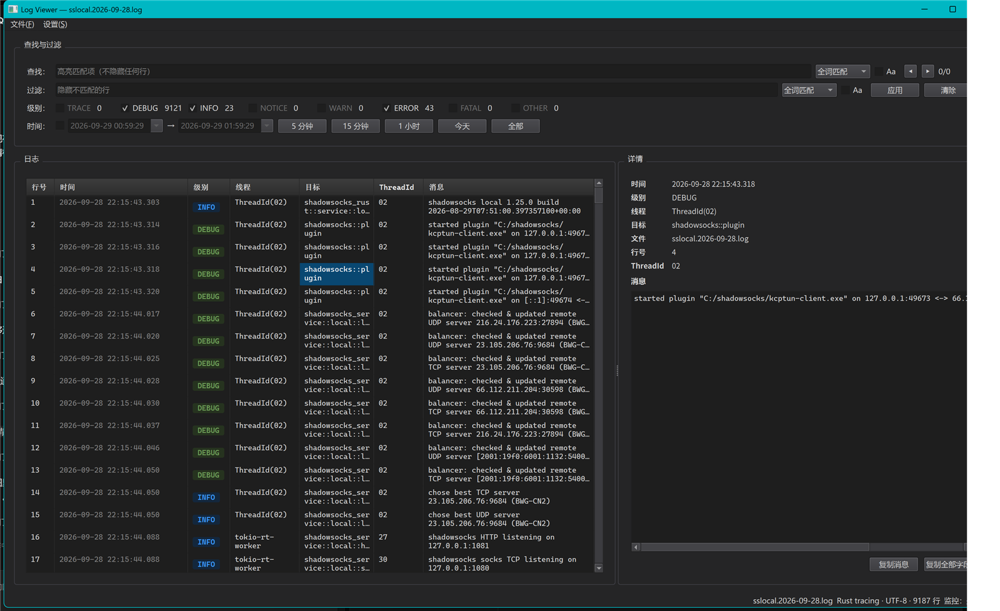

# Log Viewer（日志查看器）

一款跨平台（Windows / Linux）桌面日志查看器，基于 **Qt 6 Widgets + C++20** 构建。
以表格方式阅读文本日志，支持查找与过滤、内嵌 JSON/XML/YAML 片段的 VSCode 配色高亮，
以及类似 `tail -f` 的实时监控。



## 功能一览

| 方面 | 说明 |
| --- | --- |
| 阅读 | 表格列自动判定（行号、时间、级别、线程、目标…）；行号列默认显示源文件物理行号，Windows 事件日志 XML/TSV 导出显示条目序号；隔行交替底色 + 单元格分隔线；默认两行显示、超长以 `…` 截断；Enter 展开整行 |
| 日志格式 | Rust `tracing`、syslog（RFC 3164 / 5424）、`journalctl`（short / JSON）、JSON Lines、logfmt、CSV/TSV、Python logging、Serilog、log4j/Logback、Windows 事件日志导出（事件查看器文本/TAB、XML、`Format-List` 文本块）、IIS W3C，以及任意文本日志的通用兜底 |
| 查找 | 命中高亮（默认绿底黑字）且不隐藏任何行；支持全词 / 通配符（`*` `?`）/ 正则表达式与忽略大小写；`F3` / `Shift+F3` 导航并显示 `当前/总数` |
| 过滤 | 按级别、时间范围（绝对时刻比较）、关键词隐藏不匹配行（关键词过滤提供**反向过滤**勾选框，只保留不匹配的行）；级别复选列表按当前文件实际出现的级别动态生成，随日志切换而变化；条件之间 AND 组合；状态栏显示"显示行数 / 总行数" |
| 语法高亮 | 消息中的 JSON / XML / YAML 片段套用 VSCode Dark+ / Light+ 配色，详情面板同步 |
| 详情框 | 可选面板（右侧或底部），字段名加粗、完整展示超长消息；**隐藏时表格切换为完整内容模式**（每行按内容自适应、不截断）；双击任意单元格复制完整文本 |
| 实时监控 | `Ctrl+M` 对单个文件实现 tail -f：新行自动追加、智能跟随、轮转/截断自动重载 |
| 多文件 | 打开或拖入多个同格式文件按时间交错合并，并增加 File 列；格式不一致时明确拒绝并说明原因 |
| 编码 | UTF-8（含 BOM）、UTF-16 自动识别；非 UTF-8 自动检测 GB18030/GBK、Big5、Shift_JIS、CP1252 并转换为 UTF-8 显示 |
| 语言 | 完整英文与简体中文界面，运行时即时切换 |
| 主题 | 浅色 / 深色 / 跟随系统；语法高亮主题可独立设置 |
| 视图 | 查找与过滤分组框可折叠为标题单行，为表格腾出空间；全屏（`F11`，`Esc` 退出）自动折叠该分组框 |
| 状态栏 | 左下角显示最近一次打开日志的耗时（中文界面为「加载耗时 0.35 秒」，按秒 / 分 / 时自适应）；右侧依次显示文件名、格式、编码、行数与监控状态 |

## 环境要求

* Windows 10/11 x64（首要支持）或 glibc ≥ 2.28 的 Linux x64
* Qt 6.8.x（LGPLv3）——Windows 下由脚本自动下载安装
* CMake ≥ 3.25、Ninja、C++20 编译器（Windows 用 MSVC 2022，Linux 用 GCC ≥ 13 / Clang ≥ 16）

## Windows 构建与运行

```powershell
cd log-viewer

# 1) 一次性：下载 Qt 6.8.3 LTS（约 2 GB，支持 HTTP 代理）
.\scripts\install-qt.ps1 -Proxy http://localhost:1081     # 无需代理时省略 -Proxy

# 2) 构建（自动定位 Visual Studio、导入 vcvars64、调用 CMake + Ninja）
.\scripts\build.ps1

# 3) 运行
.\scripts\run.ps1                                                    # 空窗口
.\scripts\run.ps1 --demo                                             # 演示数据预览界面
.\scripts\run.ps1 --lang zh_CN .\test-data\sslocal.2026-09-28.log    # 中文界面 + 真实日志
.\scripts\run.ps1 -AppArgs '--version'

# 4) 测试
.\scripts\test.ps1

# 5) 便携包（可执行文件 + Qt 运行时 + 翻译，压缩为一个 zip）
.\scripts\package.ps1 -Config Release                    # 输出 dist\log-viewer-<版本>-win64.zip

# 6) 可选：把 .log 关联到本程序（仅当前用户，可撤销）
.\scripts\register-association.ps1
.\scripts\register-association.ps1 -Unregister
# 解压发行包后（例如解压到 C:\log-viewer），直接用可执行文件或随包附带的脚本，
# 两者注册的都是那一份程序：
#   C:\log-viewer\log-viewer.exe --register-association
#   C:\log-viewer\log-viewer.exe --unregister-association
```

构建产物位于 `build\windows-msvc-qt6-release\bin\log-viewer.exe`；该目录已由
`windeployqt` 部署完整，`package.ps1` 在此基础上重新部署并把可执行文件与全部依赖
（Qt DLL、插件、翻译、文档）压缩为单个 `dist\log-viewer-<版本>-win64.zip`——
`dist\` 下只有这个压缩包，解压后为顶层目录 `log-viewer-<版本>\`。版本号取自
`CMakeLists.txt`。

手动构建（任意已把 CMake/Ninja 加入 PATH 的终端）：

```powershell
cmake --preset windows-msvc-qt6-release
cmake --build --preset windows-msvc-qt6-release
ctest --preset windows-msvc-qt6-release --output-on-failure
```

## Linux 构建与运行

已在 Debian forky/sid + GCC 16.2 + Qt 6.11.2 上验证（KDE Wayland 及 offscreen
平台）：构建、15/15 单元测试、命令行、演示/真实日志冒烟与 `.deb` 生成；`.deb`
内容已核对，但未执行系统安装。

```bash
sudo apt install build-essential cmake ninja-build \
                 qt6-base-dev qt6-base-dev-tools qt6-l10n-tools qt6-tools-dev \
                 libgl1-mesa-dev

./scripts/build.sh              # cmake --preset linux-gcc-release 并构建
./scripts/test.sh               # ctest（无显示环境自动使用 offscreen）
./scripts/run.sh linux-gcc-release --demo   # 第一个参数是 preset

# Debian 包与桌面集成
./scripts/package-deb.sh        # 输出 build/linux-gcc-release/log-viewer_*_amd64.deb
sudo dpkg -i build/linux-gcc-release/log-viewer_*_amd64.deb
# 或本地安装：
./scripts/register-association.sh
```

## 命令行参数

```
log-viewer [选项] [日志文件...]

  -h, --help             显示帮助并退出
  -v, --version          显示版本与构建信息
      --lang <en|zh_CN>  覆盖界面语言（不写入设置）
      --format <id>      强制日志格式（auto 自动探测，list 列出可用 id）
      --monitor          打开单个文件后立即启用实时监控
      --demo             载入内置演示数据（仅用于界面预览）
      --register-association
                         把 .log 文件关联到本程序（仅当前用户）
      --unregister-association
                         移除 .log 关联并还原原有的关联
      --force            覆盖已有的 .log 关联且不再提示
                         （仅与 --register-association 同用）
```

退出码：`0` 正常、`1` 文件错误（关联注册失败也是 1）、`2` 参数错误。

## 快捷键与鼠标

| 操作 | 行为 |
| --- | --- |
| 单击行 | 显示/更新详情框（"显示详情框"开启时） |
| **双击单元格** | 复制该单元格完整文本到剪贴板 |
| `Enter` / `Space` | 展开 / 收起选中行 |
| `Ctrl+C` | 复制选中内容 |
| `F3` / `Shift+F3` | 下一个 / 上一个查找命中 |
| `Ctrl+F` / `Ctrl+G` | 聚焦查找 / 过滤输入框 |
| 在查找 / 过滤框内按 `Enter` | 提交并执行（查找跳到首个命中，过滤隐藏不匹配行）；输入过程中不刷新表格 |
| `Ctrl+O` / `F5` / `Ctrl+W` / `Ctrl+Q` | 打开 / 刷新 / 关闭 / 退出 |
| `Ctrl+M` | 切换实时监控 |
| `Ctrl+E` | 导出过滤后的行（CSV 或文本） |
| `F11` | 进入 / 退出全屏（*设置 ▸ 全屏*）；进入时自动折叠查找与过滤分组框 |
| `Esc` | 退出全屏（查找与过滤分组框恢复进入全屏前的状态） |
| "查找与过滤"标题右侧 `▾` / `▸` | 折叠 / 展开查找与过滤分组框（只隐藏输入行，已生效的条件继续生效） |
| `Ctrl` + 滚轮 | 临时缩放字体 |
| 把日志文件拖到窗口 | 打开（同格式自动合并）；文件夹会被忽略并提示 |
| 右键 | 复制单元格 / 整行 / 消息，列宽自适应 |

## 菜单结构

* **文件(File)** — 打开、刷新、关闭、监控（勾选项）、导出过滤结果、最近打开的文件、退出
* **设置(Settings)**
  * **字体** — 界面字体、表格字体、表头字体、恢复默认
  * **语言** — English / 简体中文（即时生效）
  * **详情框** — *显示详情框*：勾选=始终显示（打开日志自动选中第一条），取消=始终不显示；
    **布局** 子菜单选择详情框位置（右侧或底部）
  * **外观** — 主题（浅色/深色/跟随系统）、语法高亮主题（跟随主题 / VSCode Dark+ / Light+）、高亮颜色、重置全部设置
  * **文件关联** — *关联 .log 文件*：勾选项，为当前用户注册**正在运行的这一份可执行文件**（`HKCU\Software\Classes`），双击 `.log` 即用本程序打开；取消勾选即移除关联并还原原来的打开方式。勾选状态实时读自注册表，因此把程序目录搬走后会显示为未勾选，重新勾选一次即修正（不需要改脚本或手动改注册表）。只动 `.log` 一个扩展名——若该扩展名此前被“打开方式 ▸ 始终使用此应用”固定过（`UserChoice`），需在那里确认一次；本程序不会去改写那个受保护键
  * **全屏** — 勾选项，`F11`：自动折叠查找与过滤分组框并全屏显示；`Esc` 退出全屏并恢复分组框状态
* **列(Columns)** — 位于设置与关于之间的顶级菜单：按当前文档的列动态生成勾选项，取消勾选即隐藏该列（选择按文档记忆）；行号列始终显示；*显示全部列* 一键恢复
* **关于(About)** — 与文件、设置平级的顶级菜单项：版本、构建信息、许可证

## 设置存储位置

| 平台 | 路径 |
| --- | --- |
| Windows | `%APPDATA%\LogViewer\settings.ini` |
| Linux | `$XDG_CONFIG_HOME/LogViewer/settings.ini`（通常为 `~/.config/LogViewer/`） |

设置项包括字体、语言、布局、主题、高亮颜色、单文件行数上限、续行合并、最近文件与
最近文档的列宽。`设置 ▸ 外观 ▸ 重置全部设置` 可恢复默认值。

## 文档

* `docs/spec.md` — 需求规格说明书（唯一权威来源）
* `docs/design-doc.md` — 技术设计与实施记录
* `screenshots/` — 精选界面截图（索引见 `screenshots/README.md`）

## 目录结构

```
src/app/        设置、主题、翻译、命令行
src/core/       行索引、数据源、日志格式解析器、表格模型、匹配器、监控
src/highlight/  VSCode 配色表、JSON/XML/YAML tokenizer、消息高亮
src/platform/   平台相关实现（编码、字体、路径）
src/ui/         主窗口、过滤面板、表格视图、详情框、对话框
tests/          Qt Test 测试（14 个目标）与冻结日志样本（tests/data/）
test-data/      本地手工测试用的样本日志（已加入 .gitignore，不入库）
scripts/        构建、测试、运行、打包与文件关联脚本
packaging/      Linux 桌面项、AppStream 元数据、图标、CPack DEB
```

## 许可证

MIT。Qt 6 依据 GNU 宽通用公共许可证第 3 版使用。
